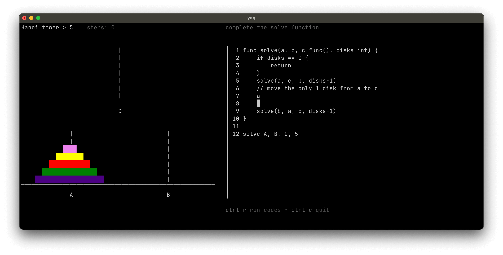

# yaqs

Terminal games for learning programming, powered by [yaq](https://github.com/zrcoder/yaq).

- turtle graphics

- code star

 
- hanoi tower



## install yaq

```shell
go install github.com/zrcoder/yaq/cmd/yaq@latest
```

## run games

```shell
git clone https://github.com/zrcoder/yaqs
cd yaqs
yaq code-start
# yaq turtle-graphics
# cd hanoi && yaq
```
